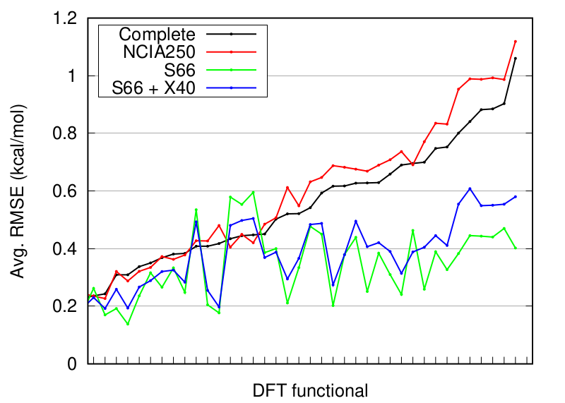

NCIA250 subset
==============

NCIA250 is a condensed subset extracted from the five NCIA data sets featuring diverse non-covalent interactions in neutral molecules: HB375, HB300SPX, R739, SH250 and D1200. From each of these data sets, 50 representative systems in equilibrium geometry (except R739) had been selected using a clustering analysis. The NCIA250 set was introduced in [this paper](https://doi.org/10.1039/D2CP01602H).

In benchmarking of DFT methods, the NCIA250 set had been show to reproduce the results in the complete NCIA data sets almost perfectly. A comparison with results in the S66 set, and in the combination of S66 and X40 shows that NCIA250 is a more difficult test case because of its higher diversity and coverage of wider chemical space. This is shown in the following figure:

### Download
A package of geometries with benchmark interaction energies and additional metadata is available [here](NCIA250.zip).
